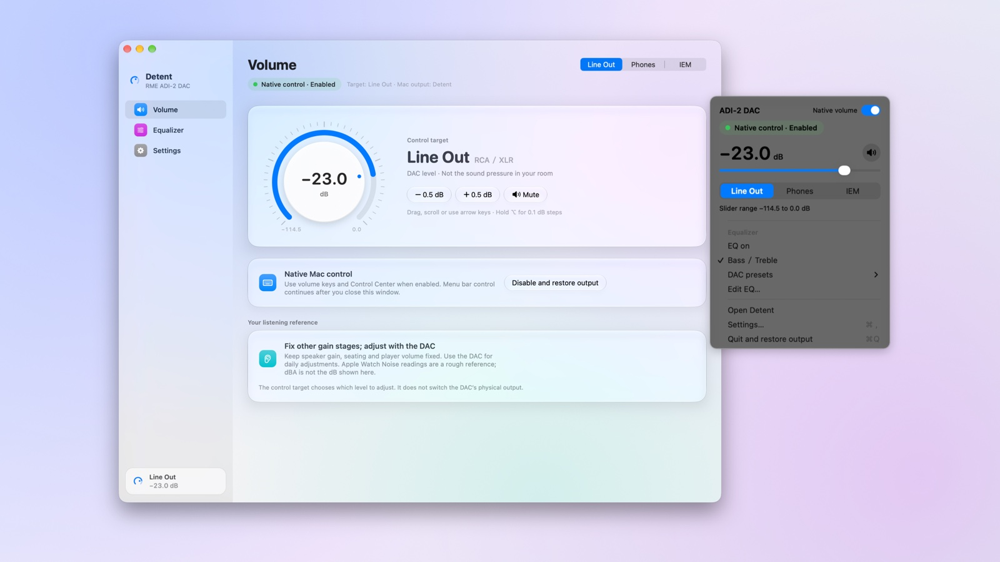
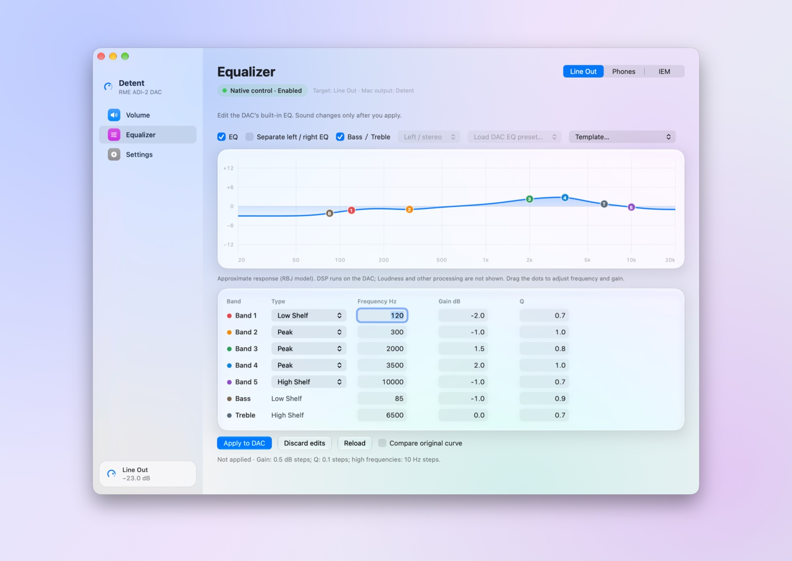
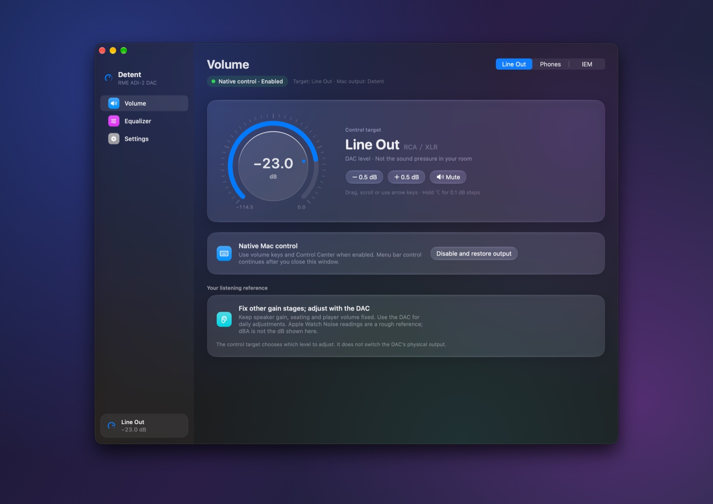

<p align="center"></p>

# Detent

Native macOS volume control for the **RME ADI-2 DAC**, with a menu bar app and built-in EQ editor.

Detent was previously named ADI2 Native. Installing 0.6 removes the old driver and carries your preferences over.

[繁體中文](README.zh-TW.md)



A Swift/AppKit app controls the DAC's hardware volume through USB MIDI. A Core Audio HAL proxy forwards stereo PCM, connecting macOS volume keys and Control Center to the DAC's volume setting.

## Features

<p>


</p>

- System volume and DAC volume synchronization; Line Out, Phones and IEM control targets.
- Rotary volume dial (drag, scroll or arrow keys; ⌥ for 0.1 dB steps), plus menu bar volume/mute controls whose icon shows the current level. Optional Dock icon and launch at login.
- Five-band EQ, separate left/right editing, Bass/Treble, twelve starting-point templates, loading DAC presets and saving the edited EQ into one (verified by reading it back), and a response graph whose band handles can be dragged to set frequency and gain.
- Per-output volume ranges and a software volume ceiling.
- Traditional Chinese / English interface. Appearance follows the system or is fixed to Light or Dark; on macOS 26 and later the sidebar, cards and buttons use Liquid Glass.
- Output-only playback streams, expiring playback lease, and visible driver errors.

## Status and requirements

Source release: **App 0.6.0 / driver 0.4.0**. Local development build, not a notarized 1.0 release.

- Apple Silicon Mac; the build script targets macOS 13 or newer. Local hardware testing has been on macOS 27; other OS versions are not yet validated.
- Xcode Command Line Tools (`xcode-select --install`).
- Exactly one RME ADI-2 DAC connected over USB, with firmware supporting the official MIDI remote protocol. ADI-2 Pro and 2/4 Pro are not supported.
- Administrator authentication to install the HAL driver.

Seven test suites pass, including simulated failures and recovery. The latest 0.6.0 / 0.4.0 changes have passed compilation and automated tests; final installation/hardware verification is pending. Extended playback, physical reconnect and sleep/wake coverage across machines remains incomplete.

## Build and test

```sh
git clone https://github.com/vendyluo/detent.git
cd detent
./Scripts/build.sh
./Scripts/test.sh
```

Icons are generated locally by `Scripts/render-icons.swift`, which also writes the vector logo `Assets/Logo.svg` from the same geometry. Local builds use ad-hoc signing by default. The DMG prepared on 2026-09-26 passed Developer ID signing, Apple notarization, and Gatekeeper validation. `Scripts/release.sh` supports signed and notarized releases; see the signing section in README.zh-TW.md. The DMG currently contains a folder with command-based installation tools; a graphical PKG installer is still pending.

## Install and use

1. Quit any running Detent app.
2. Run `./Install.command` and complete the macOS administrator prompt. Installation briefly restarts the Mac audio service.
3. Choose a control target and enable native volume control in the app.
4. Keep the app running; closing the window leaves menu bar control active.

Keep the app at the same path after enabling launch at login. Moving it requires setting up login launch again.

To uninstall, quit the app and run `./Uninstall.command`. This removes the HAL driver and restarts the audio service; project files remain.

## Behavior and limitations

- The proxy is a separate output named `Detent`; it does not modify the original USB device.
- The proxy does not apply a second digital attenuation: hardware gain is set on the DAC. It adds buffering (512 frames by default).
- The volume ceiling is software-enforced while native control is enabled; the physical knob can briefly exceed it. It is not a hardware hearing-protection limiter.
- Selecting Line Out/Phones/IEM selects the controlled volume, not the DAC's physical audio route.
- The macOS balance setting is kept but not applied: gain is set on the DAC, so use the DAC's own balance setting.
- If the DAC locks the controlled output's volume, playback moves to the physical DAC and native control resumes automatically once it is unlocked.
- Driver 0.3.x and later use configuration protocol 4. After updating the app, run `./Install.command` again; the app reports an outdated driver until you do.
- Stereo PCM only; DSD/DoP and exclusive playback are unsupported. Players using the physical DAC directly bypass the proxy.
- A missing app lease silences proxy playback. If recovery fails, manually select the physical DAC in macOS Sound settings.
- EQ response graphs are approximate. Applying edits changes current settings, not stored preset slots.
- Saving to a DAC preset writes only that slot and is verified by reading it back. A preset that any output has selected cannot be replaced, and presets cannot be deleted (see below).

### DAC EQ presets: measured device behavior

Measured on an ADI-2 DAC FS in October 2026. Where the device differs from RME's MIDI table (`MIDITable_ADI-2_230930`), Detent follows the device.

- **The flag word is reported at index 1 but written at index 2.** RME's table lists EQ-Preset-Flags at index 2 (address 13); its read example and the device report it at index 1. The device ignores a flag written at index 1. Bits 8..4 are the preset number counted from zero, bit 0 is Dual EQ, and all four low bits set means empty.
- **The flag commits a buffer.** Address 13/14 parameters and the preset name (`0x06`) go into a temporary buffer that the flag word stores into the given slot. Send the name before the flag. The buffer keeps its contents afterwards, so a later flag stores the same data again.
- **There is no delete.** A flag with the empty pattern does not clear a slot; it stores the buffer like any other flag. RME has said on its forum that single-preset delete was left out on purpose because there is no undo. A slot can only be overwritten.
- **Presets do not store EQ Enable or B/T Enable.** Bands, Bass/Treble gain/frequency/Q and the name are stored.
- **Read-back arrives in parts:** the flag, both channels' bands (right as zeros when Dual EQ is off), then Bass/Treble in a later message, then the name as 14 right-aligned ASCII characters.
- **Replacing a preset that an output has selected changes that output's live EQ.** Band types and gains of that output are reset while frequencies and Q stay. Switching that output to Manual first does not help: Manual has its own stored EQ, and selecting it loads that EQ. Detent therefore only saves into presets that no output has selected; saving into such a preset leaves every output unchanged.
- **EQ Preset Select (index 28):** 0 Manual, 1 Temp, 2–21 presets 1–20, 22 clear. Editing bands directly switches a preset selection to Temp.

Hardware verification is available via `./Scripts/verify-live.sh`. It changes routing, volume, mute and EQ temporarily and attempts to restore them. Close the app first. This is not part of the hardware-free test suite.

## License

Original code and modifications: [MIT](LICENSE). Bundled third-party code retains its own licenses; see [THIRD_PARTY_NOTICES.md](THIRD_PARTY_NOTICES.md).

Independent community project; not affiliated with, sponsored or endorsed by RME or Apple. RME and ADI-2 are trademarks of their respective owners and are used here only to describe compatible hardware.
