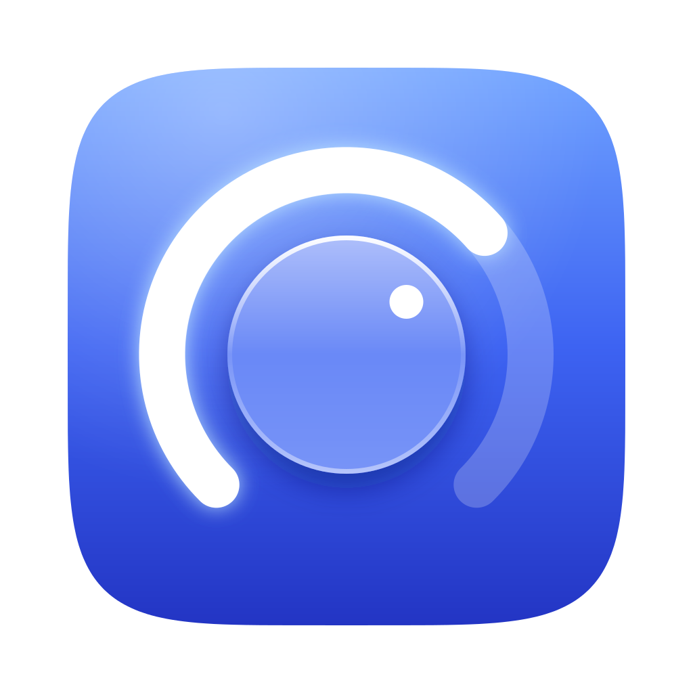

<p align="center"></p>

# ADI2 Native

讓 Mac 音量鍵與控制中心直接調整 **RME ADI-2 DAC 的硬體音量**。使用 Swift／AppKit 原生介面，提供音量旋鈕（拖曳、捲動或方向鍵，按住 ⌥ 以 0.1 dB 微調）、會顯示目前音量的選單列圖示、可直接拖曳頻段的五段 EQ、Bass／Treble、DAC 預設載入，以及繁體中文／英文切換。外觀可跟隨系統或固定為淺色／深色；macOS 26 以上的側欄、卡片與按鈕使用 Liquid Glass。

[English / 完整技術說明](README.md)

## 目前狀態

App **0.5.0**、HAL 驅動 **0.3.1**。2026-09-26 的 DMG 已完成 Developer ID 簽署、Apple 公證及 Gatekeeper 驗證，尚未宣稱正式 1.0。七組自動測試通過；最新版的最終安裝及實機驗證仍待完成。

需要 Apple Silicon Mac、Xcode Command Line Tools，以及透過 USB 連接的一台 ADI-2 DAC。編譯目標為 macOS 13 以上，實機測試環境為 macOS 27；其他版本尚未完整驗證。Pro／2/4 Pro 不在支援範圍。

## 建置與安裝

```sh
git clone https://github.com/vendyluo/adi2-native.git
cd adi2-native
./Scripts/build.sh
./Scripts/test.sh
./Install.command
```

安裝前先結束 App。安裝驅動需要在 macOS 視窗完成管理員驗證，會短暫重新啟動音訊服務。之後選擇控制目標並啟用原生音量即可。關閉視窗仍會在選單列執行；可在設定調整 Dock 顯示、登入啟動及語言。

開啟登入啟動後請保留 App 路徑；若移動 App，需重新設定登入啟動。

解除安裝：結束 App 後執行 `./Uninstall.command`，移除驅動但保留專案檔案。

## 使用限制

- 只支援雙聲道 PCM，不支援 DSD／DoP 或獨占播放。
- 音量上限由軟體校正，硬體旋鈕可能短暫超過上限，不是硬體聽力保護。
- 控制目標不會切換 DAC 實體輸出插孔。
- macOS 的左右平衡設定會保留但不會作用：音量由 DAC 硬體調整，請使用 DAC 本身的平衡設定。
- 若 DAC 鎖定了目前控制的音量，播放會改由實體 DAC 進行，解鎖後自動恢復原生控制。
- 驅動 0.3.x 使用設定協定 4。更新 App 後請重新執行 `./Install.command`，在此之前 App 會提示驅動過舊。
- App 失聯後代理音訊會靜音；若無法恢復，可在 macOS 聲音設定選回實體 DAC。
- EQ 曲線為近似示意；套用編輯不會覆寫 DAC 儲存的預設。
- 跨機器長時間播放、拔插及睡眠喚醒仍需更多驗證。

原創程式採 [MIT](LICENSE)，第三方授權見 [THIRD_PARTY_NOTICES.md](THIRD_PARTY_NOTICES.md)。本專案與 RME、Apple 無隸屬或背書關係。

## Developer ID 簽署與公證

本機建置預設維持 ad-hoc 簽署。正式發佈使用：

```sh
export ADI2_SIGN_IDENTITY='Developer ID Application: YOUR NAME (TEAM_ID)'
./Scripts/release.sh
```

此流程對 App、HAL 驅動啟用 Hardened Runtime 與安全時間戳記，建立
`build/release/ADI2-Native.dmg`，包含安裝／解除安裝工具與授權說明。
未設定公證認證時只產生簽署版本，不能宣稱已通過 Apple 公證。

首次公證前，在自己的終端機互動設定認證（不要把密碼寫入腳本或版本庫）：

```sh
xcrun notarytool store-credentials adi2-notary --apple-id YOUR_APPLE_ID --team-id YOUR_TEAM_ID
```

依提示輸入 Apple 帳號網站產生的 App 專用密碼，然後執行：

```sh
ADI2_NOTARY_PROFILE=adi2-notary ./Scripts/release.sh
```

腳本只有在 Apple 回報 Accepted 後才附加公證票證，並檢查票證及 Gatekeeper。
公證不代表驅動的實機相容性測試已完成；發佈前仍須驗證安裝、播放及睡眠喚醒。

目前 DMG 仍採資料夾式封裝，包含 `.command` 安裝工具；圖形化 `.pkg` 安裝程式尚未完成。
